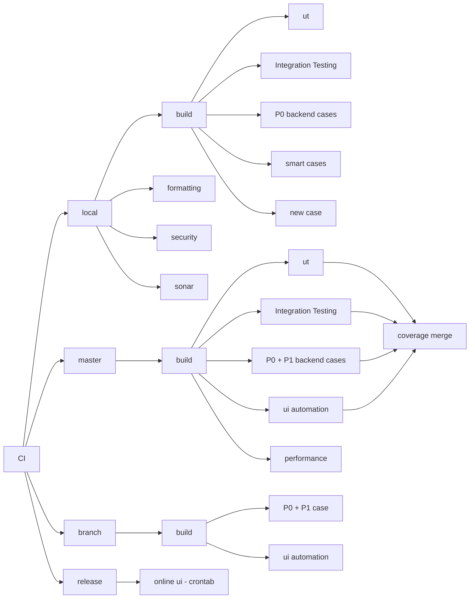

# matrix-example

📘 Description

This diagram outlines the core structure of our CI (Continuous Integration) pipeline.
	•	CI Entry: The pipeline entry point splits into four tracks: local, master, branch, and release.

---

🔧 **Local**
	•	Triggered for local development (e.g., feature branches).
	•	Contains fast checks and basic validations:
		•	Build, Unit Testing, Integration Testing.
		•	P0 backend cases, smart regression, and newly added cases.
		•	Code formatting, security scans, and Sonar checks.
	•	**Note**: These basic checks are only done at this stage and are not repeated later.

---

🧩 **Master**
	•	Triggered on mainline (e.g., master or main branches).
	•	Covers comprehensive testing strategies:
		•	Build, Unit Testing, Integration Testing.
		•	P0 + P1 backend cases, UI automation, and performance testing.
	•	**Code coverage** is evaluated here and merged from multiple test stages.

---

🚦 **Branch**
	•	Used for pre-release regression testing on specific branches.
	•	Runs key P0 + P1 backend cases and UI automation to ensure quality before merging or release.

---

🚀 **Release**
	•	Periodically triggered via **cron schedule**.
	•	Performs online UI health checks using Playwright or other tools.
	•	Ensures that production environments remain stable and functional.

