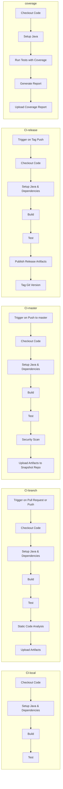

# matrix-example

```mermaid
flowchart LR
    subgraph CI-local
        L1[Checkout Code]
        L2[Setup Java & Dependencies]
        L3[Build]
        L4[Test]
        L1 --> L2 --> L3 --> L4
    end

    subgraph CI-branch
        B1[Trigger on Pull Request or Push]
        B2[Checkout Code]
        B3[Setup Java & Dependencies]
        B4[Build]
        B5[Test]
        B6[Static Code Analysis]
        B7[Upload Artifacts]
        B1 --> B2 --> B3 --> B4 --> B5 --> B6 --> B7
    end

    subgraph CI-master
        M1[Trigger on Push to master]
        M2[Checkout Code]
        M3[Setup Java & Dependencies]
        M4[Build]
        M5[Test]
        M6[Security Scan]
        M7[Upload Artifacts to Snapshot Repo]
        M1 --> M2 --> M3 --> M4 --> M5 --> M6 --> M7
    end

    subgraph CI-release
        R1[Trigger on Tag Push]
        R2[Checkout Code]
        R3[Setup Java & Dependencies]
        R4[Build]
        R5[Test]
        R6[Publish Release Artifacts]
        R7[Tag Git Version]
        R1 --> R2 --> R3 --> R4 --> R5 --> R6 --> R7
    end

    subgraph coverage
        C1[Checkout Code]
        C2[Setup Java]
        C3[Run Tests with Coverage]
        C4[Generate Report]
        C5[Upload Coverage Report]
        C1 --> C2 --> C3 --> C4 --> C5
    end
```