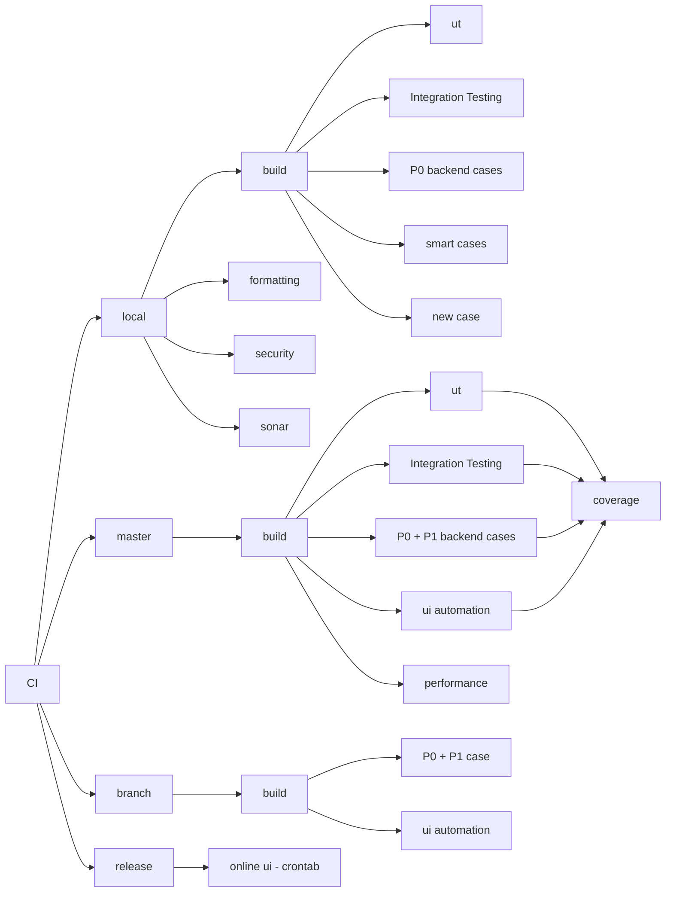

# matrix-example

```mermaid
graph LR  
  CI --> local
  CI --> master
  CI --> branch
  CI --> release

  %% === local ===
  local --> local_build[build]
  local_build --> local_ut[ut]
  local_build --> local_integration[Integration Testing]
  local_build --> local_p0[P0 backend cases]
  local_build --> local_smart[smart cases]
  local_build --> local_new[new case]
  local --> local_formatting[formatting]
  local --> local_security[security]
  local --> local_sonar[sonar]

  %% === master ===
  master --> master_build[build]
  master_build --> master_ut[ut]
  master_build --> master_integration[Integration Testing]
  master_build --> master_backend[P0 + P1 backend cases]
  master_build --> master_ui[ui automation]
  master_build --> master_perf[performance]

  %% Group coverage dependencies
  master_ut --> coverage
  master_integration --> coverage
  master_backend --> coverage
  master_ui --> coverage

  coverage[coverage]

  %% === branch ===
  branch --> branch_build[build]
  branch_build --> branch_case[P0 + P1 case]
  branch_build --> branch_ui[ui automation]

  %% === release ===
  release --> release_ui[online ui - crontab]
```