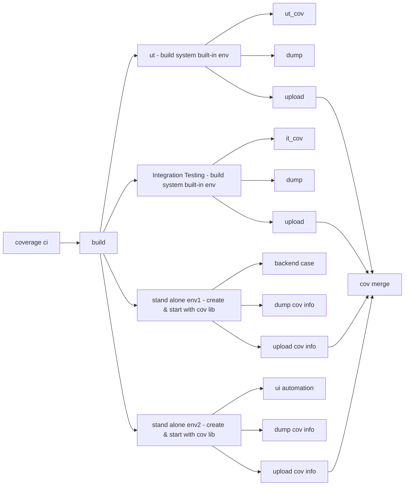

## **✅ Code Coverage Collection & Merge Pipeline**

This section describes a **detailed code coverage pipeline**, focusing specifically on how different test stages collect and merge coverage data. It expands upon the general CI pipeline by illustrating the separation between tests run in **built-in environments** and those requiring **standalone environments**.

### **🧪 Test Types & Environment Strategies**

- **Unit Tests (UT)** and **Integration Tests (IT)**:

    - Executed within the **default build environment** provided by the CI system.
    - Coverage dump and upload scripts are executed directly after test execution.
    - These steps are lightweight and tightly integrated into the standard CI lifecycle.

    

- **Backend API Tests** and **UI Automation Tests**:

    - Require **standalone environments** that are provisioned with additional libraries and runtime configurations (e.g., coverage instrumentation).

    - These environments are created and started before test execution begins.

    - Additional steps are needed to:

        - Configure the environment (e.g., start servers with coverage hooks).
        - Dump coverage data from runtime memory or files.
        - Upload the results to a centralized coverage store or artifact registry.

        

### **📊 Final Step: Coverage Merge**

All coverage data collected from UT, IT, backend, and UI tests is merged in the final cov merge step. This ensures that:

- Coverage reports reflect the **entire system** under test.
- Gaps in coverage from individual layers are highlighted holistically.
- Engineers can trace uncovered code paths whether in unit logic, backend APIs, or frontend behavior.

This setup supports full-stack visibility and promotes better test completeness across heterogeneous systems.
