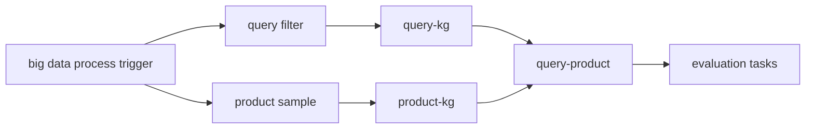

## **🔍** Big Data Processing Pipeline

This repository contains a structured data pipeline for large-scale query-product matching based on knowledge graph (KG) strategies. The pipeline is designed to support the refinement and evaluation of advertising targeting logic.

### 📘 **Workflow Description**

•	**Trigger Stage**: Initiates the entire big data process at a scheduled time or via manual dispatch.

•	**Query Filtering**: Preprocesses search queries to remove noise or irrelevant inputs before KG matching.

•	**Product Sampling**: Selects a representative subset of products for KG evaluation and matching.

•	**KG Computation**:

​	•	query-kg: Calculates the semantic relationships between queries and the knowledge graph.

​	•	product-kg: Determines the KG links of candidate products.

•	**Query-Product Matching**: Combines both query and product KG features to perform relevance matching using graph-based logic.

•	**Evaluation Tasks**: Assesses the performance and impact of updated query-kg and product-kg strategies using evaluation metrics.

This pipeline is used to support the development and deployment of intelligent, knowledge-driven recommendation and ad targeting systems.